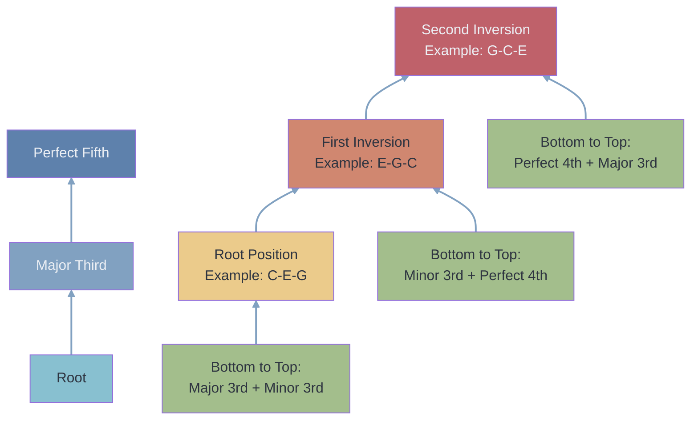
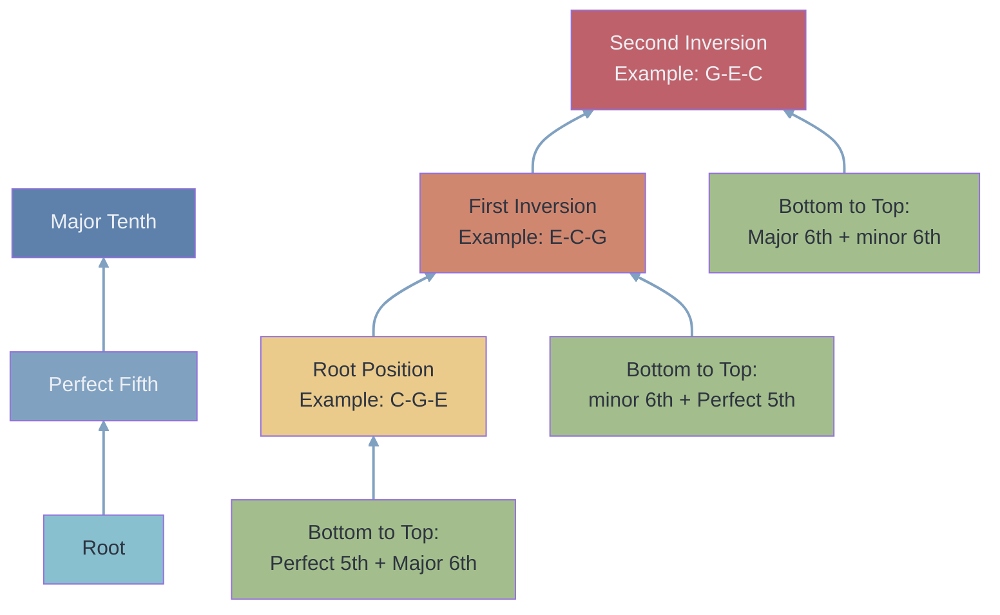

---
tags:
  - 🌱
  - musictheory
  - chord
  - "#structure"
function:
  - T
  - D
---
Major triads are a very common and useful building block of music. They are found on different degrees of most scales such as: 
- [[major scale]]
- [[melodic minor scale]]
- [[harmonic minor scale]]

They can be found in two configurations:
- [[closed position]]
- [[spread voicing]]

# in closed position
## composition

## on a staff
```music-abc
X:1
T:C Major Triad and Inversions
M:4/4
L:1/4
K:C
[CEG]2 [EGc]2| [Gce]2 |]
```

# in spread position

## composition

## on a staff
```music-abc
X:1
T:C Major Triad - Spread voicings
M:4/4
L:1/4
K:C
% Open voicings (spread)
[CGe]2 [Ecg]2|[Gec']2  |
```
# on the neck
[[major triads in standard tuning]]
[[major triads in P4]]