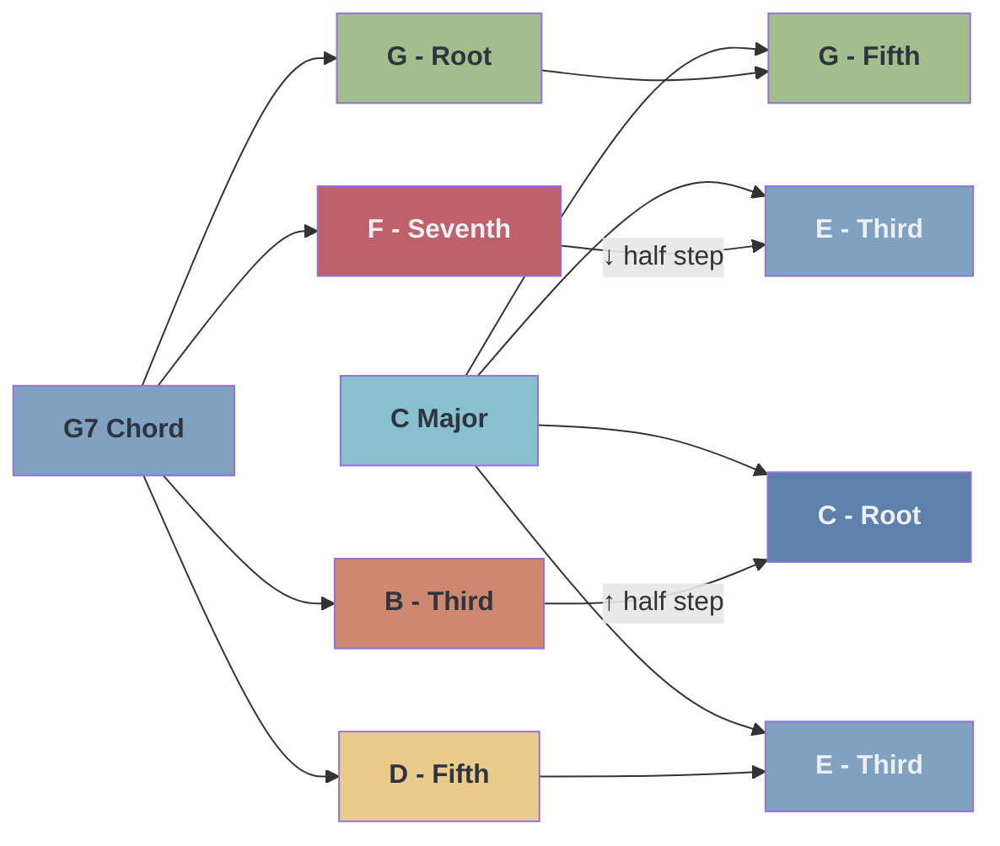

---
tags:
  - 🌲
  - musictheory
aliases:
  - dominant 7
---
The chord found on the fifth degree of the major scale when harmonising it in tetrads is very important, it gives us our [[dominant]] chord. It is one of the most important chord in [[tonal music]], even in styles that don't commonly use [[chord extensions]] we will find V7 chords. Even the simplest nursery rimes make use of this chord for [[tension and release]]. It is also the chord we use to play the [[blues]].

# why it works as tension

The V7 chord is the perfect tension chord and the [[V - I]] cadence gives release thanks to the resolution of the double leading notes. Here G7 has two notes (B and F forming a [[Tritone]]) that are a [[the 12 semitones|half step]] away from a [[chord tone]] of the [[tonic]] creating a strong pull. 

# the most extensible chord
The dominant 7 is the type of chord that can feature the widest range of [[chord extensions]]. All [[scale degrees]] can be altered and used as extensions to make the chord more dissonant or tense.

[[V7 chord alterations]]