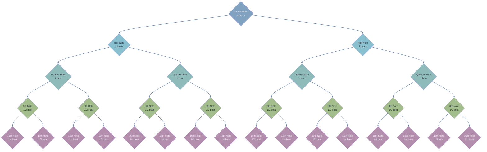

---
tags:
  - 🌲
  - musictheory
  - rhythm
  - basics
upstream:
  - "[[music theory]]"
  - "[[the beat]]"
  - "[[tempo markings]]"
downstream:
  - "[[how to practice reading rhythm]]"
aligned: 
contrasting:
  - "[[compound time]]"
aliases:
  - simple time
---
Rhythm notation is all about division. Rhythm is maths. All note lengths are expressed as a fraction of the whole note. 

Here is one way to visualise it:
# diagram




# on a staff

```music-abc
X:1
T:Basic Rhythm Divisions
M:4/4
L:1/4
K:C
%%score (1)
V:1 clef=treble
%% Whole note
C4 ||
%% Half notes
C2 C2 ||
%% Quarter notes
C C C C ||
%% Eighth notes
c/2c/2 c/2c/2 c/2c/2 c/2c/2 ||
%% Sixteenth notes
c/4c/4c/4c/4 c/4c/4c/4c/4 c/4c/4c/4c/4 c/4c/4c/4c/4 ||
```


# US vs UK
There are two terminologies used by UK and US, for once the US is the most straight forward and easy to understand one.

| American Term  | British Term | Relative Duration |
| -------------- | ------------ | ----------------- |
| Whole note     | Semibreve    | 4 beats           |
| Half note      | Minim        | 2 beats           |
| Quarter note   | Crotchet     | 1 beat            |
| Eighth note    | Quaver       | ½ beat            |
| Sixteenth note | Semiquaver   | ¼ beat            |

# how about silence?
```music-abc
X:1
T:Basic Rest Divisions
M:4/4
L:1/4
K:C
%%score (1)
V:1 clef=treble
%% Whole rest
z4 ||
%% Half rests
z2 z2 ||
%% Quarter rests
z z z z ||
%% Eighth rests
z/2z/2 z/2z/2 z/2z/2 z/2z/2 ||
%% Sixteenth rests
z/4z/4z/4z/4 z/4z/4z/4z/4 z/4z/4z/4z/4 z/4z/4z/4z/4 ||

```
These are the symbols used to indicate rest, silence, of the same length as the previous table.
# [[how to practice reading rhythm]]

# how about [[dotted note|dotted notes]]?
