---
tags:
  - musictheory
  - 🪴
aliases: 
upstream:
  - "[[chord voicings]]"
downstream: 
aligned: 
contrasting:
  - "[[root position]]"
---

Inversions are a different way to organise the note of a chord than [[root position]], it means starting the chord from another note than the root while respecting all the pitches.

There are as many inversions of a chord as there are notes other than the [[root]].

For example here are the two inversions of a C [[Major triad]].

```mermaid
graph BT
    subgraph "Second Inversion"
        S1[G ⑤] --> S2[C ①]
        S2[C ①] --> S3[E ③]
        Title1[C/G<br>G-C-E]
    end
    
    subgraph "First Inversion"
        F1[E ③] --> F2[G ⑤]
        F2[G ⑤] --> F3[C ①]
        Title2[C/E<br>E-G-C]
    end
    
    subgraph "Root Position"
        R1[C ①] --> R2[E ③]
        R2[E ③] --> R3[G ⑤]
        Title3[C Major<br>C-E-G]
    end

    %% Style definitions using Nord theme colors
    classDef default fill:#3B4252,stroke:#88C0D0,color:#D8DEE9
    classDef title fill:#4C566A,stroke:#88C0D0,color:#ECEFF4
    classDef note fill:#5E81AC,stroke:#88C0D0,color:#ECEFF4
    
    %% Apply styles
    class Title1,Title2,Title3 title
    class R1,R2,R3,F1,F2,F3,S1,S2,S3 note

    %% Layout direction
    direction LR
```

The first inversion starts on the 3rd of the chord (the first note past the Root), then comes the fifth and finally the Root now the highest note. Since the chord is still a C Major triad it is still called C, but because its lowest note is now E it it notated C/E.

The second inversion starts on the 5th (the second note past the Root), then comes the Root and finally the third as the highest note. This inversion would be notated C/G.

> [!NOTE] Notation
> Inverting a chord doesn't change its nature, a C triad is still a C triad wether its lowest note is the Root or not. To signify an inverted chord, we use C/E or C/G.

# works for any [[chords|chord]] or [[structure]]
Any chord can be inverted, the same principles apply to [[tetrads]] or any other chord type. 

For example we could encounter Cmaj7/E

[[closed position]] chords and [[spread voicing|spread voicings]] can be inverted
