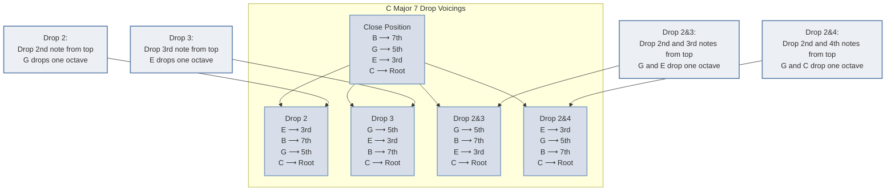

---
tags:
  - fretboardtheory
  - 🪴
aliases:
  - drop voicing
  - spread voicings
  - drop voicings
upstream:
  - "[[chord voicings]]"
downstream:
  - "[[drop 2]]"
  - "[[drop 3]]"
  - "[[drop 24]]"
aligned: 
contrasting:
  - "[[closed position]]"
---
Spread voicings refer to [[chord voicings]] where notes are further apart than in [[closed position]]. Some notes are an octave above where they would be in closed position.

There is a way to categorise these more spread out voicings using a concept called drop voicings.

# spread triads
Spread [[triads]] consists of moving one of the notes up an octave.
# drop voicings
Drop voicings are a way to organise [[chord voicings]], they are constructed by dropping one or two notes from a chord down an octave. If you have played the standard CMaj7 chord with the root on the 5th string you have already played a drop chord. 

Let's look at how drop voicings work starting with drop 2.

- Let's start with a CMaj7 chord in [[root position]]
	- C E G B all within one octave
- then we drop the second highest note by an octave
	- we get G C E B
- we need to put it back on a C bass 
	- we go through the [[inversions]] of this new voicing, moving every note to the next available in the chord until we reach a chord with a C bass
- we end up with C G B E which is our basic drop 2 voicing:

```jtab
%x/x.3/1.5/3.4/2.5/4.x/x[CMaj7]
```

The same logic applies to all other drop voicings and works for any chord type, here is a diagram of the different possible drop voicings for a CMaj7 chord.




[[drop 2]]
[[drop 3]]
[[drop 2&3]]
[[drop 2&4]]