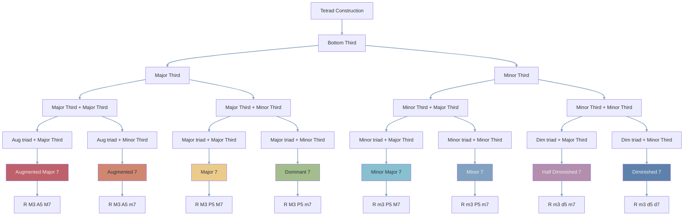

---
tags:
  - 🪴
  - musictheory
aliases:
  - seventh chords
---
Tetrads are a [[triads|triad]] on which we piled another third, it is a stack of 3 thirds. 

We can build bigger even bigger chords, every note added to a tetrad is called an [[chord extensions|extension]].

There are 8 possible tetrads, some of them only appear when harmonising particular scales. 

Tetrads have a more complex and rich sound than [[triads]] and thus are used more in [[jazz]] than in [[pop music]]. 

The most used tetrads are:
- [[Major 7]]
- [[dominant]]
- [[minor 7]]
- [[half diminished]]

They are the most used as they are naturally found in the [[major scale]].

# [[major scale harmonisation in tetrads]]
# [[harmonic minor scale harmonisation in tetrads]]
