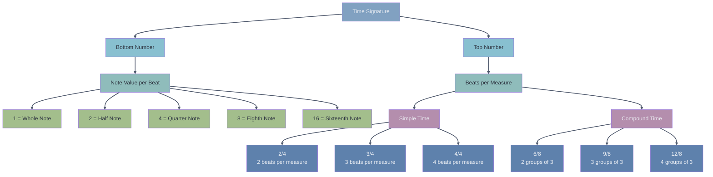

---
tags:
  - 🪴
  - musictheory
  - rhythm
  - basics
---
The time signature of a piece is found at the beginning of the staff right along the [[key signature]]. It is composed of two numbers on top of each other. The top number tells us the number of [[the beat|beats]] per [[bars|bar]] while the lower tells us the [[basic rhythm notation|value]] of said beats.

The most common time signature you will encounter in western music is 4/4 meaning four quarter notes per bar.

# three types of time signature
There are three big families of time signatures. One where we divide each beat in 2 called [[simple time]] or [[simple time|binary]], one where we divide the beat in three [[compound time]] or [[compound time|ternary]] and finally [[odd meters]] or [[odd meters|asymmetric meters]] where we have an odd number of beats per bar.

# [[simple time]]
This is the most common type of time signature and makes use of [[basic rhythm notation]]. 4/4, 2/2, 3/4 all fall under this category.

## [[compound time]]
While present in western music it is less common than simple time. Every quarter note is now a [[dotted note]] and is divided in three eighth notes. 6/8, 12/8 are compound time signatures.

## [[odd meters]]
Another animal altogether – usually found in [[progressive metal]], Balkan folk music or contemporary classical music – it features an odd number of beats per bar and can be decomposed in a variety of subdivisions. For example 5/8, 11/16, 7/8 are all odd meters.
