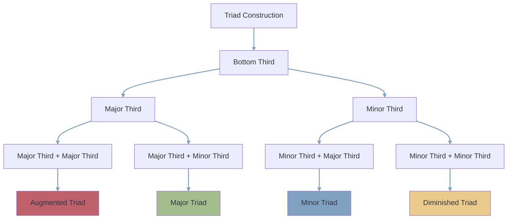

---
tags:
  - basics
  - musictheory
  - 🌲
  - 🗺
---
triads are a type of 3 notes chord composed of two [[thirds]] stacked on top of each other, there are four possible triads

# analysing their composition
![[triad composition.svg]]
#  augmented triad
composed of two stacked [[Major 3rd]] the augmented triad is not found in the [[major scale harmonisation in triads|major scale harmonisation]] but is present in multiple minor scales harmonisations

it is not a stable chord and is mostly used as a [[structure]] on top of a different bass

it is the triad spanning the biggest range 

# Major triad
Major triads are among the building blocks of basic harmony and [[cadence|cadences]] they have a bright happier sound than minor triads 

they are found on multiple [[scale degrees]] when harmonising the [[major scale]] or [[minor scales]]

# minor triad
another building block of simple harmony, they are darker sounding and feel sadder than Major chords

we find them on multiple scale degrees when harmonising both the major scale and minor scales

# diminished triad
it is composed of two stacked [[minor 3rd]]

a chord that plays a role of tension, used as [[dominant]] or [[sub dominant]] in both major and minor keys

# [[root position]]
Here we see them in Root position, meaning the notes are in order from the [[root]].

# [[inversions]]
They can also be inverted, changing the order of the notes.