---
tags:
  - 🌲
  - musictheory
---
There are plenty of two chord cadences, here are the most common. 

```mermaid
%%{ init: {
  "theme": "base",
  "themeVariables": {
    "primaryColor": "#81A1C1",
    "primaryBorderColor": "#88C0D0",
    "primaryTextColor": "#ECEFF4",
    "lineColor": "#D8DEE9",
    "secondaryColor": "#5E81AC",
    "tertiaryColor": "#434C5E",
    "background": "#2E3440"
  }
}}%%
mindmap
  root((Two-Chord<br>Cadences))
    Authentic
      V - I
        Perfect authentic major
      V7 - I
        Common dominant resolution
      V - i
        Perfect authentic minor
      VII - I
        Leading tone resolution
    Plagal
      IV - I
        Traditional Amen cadence
      iv - I
        Minor plagal
      IV - i
        Mixed mode
    Modal
      ♭VII - i
        Rock/modal minor
      ♭VII - I
        Mixolydian cadence
      v - i
        Natural minor
    Jazz
      II7 - I
        Jazz turnaround
      ♭II7/SubV7 - I
        Tritone substitution
      V7alt - I
        Altered dominant
    Blues
      I7 - IV7
        Blues turnaround
      V7 - I7
        Blues dominant
      IV7 - I7
        Blues plagal
    Deceptive
      V - vi
        Common deceptive
      V - ♭VI
        Dramatic deceptive
      V7 - vi7
        Jazz deceptive

```

# the musical period, cadences that resolve
The most common type of cadence, the one we are most familiar with are authentic cadences. The movement from [[dominant]] to [[tonic]]. They exist in both [[major scale]] and [[minor scales]] harmony and provide a strong feeling of resolution. 

There exists variations of this [[perfect cadence]] such as resolving to Major or minor, using [[triads]] or [[tetrads]]. 
# the comma, deceptive and surprising
Some cadences do not aim at giving a strong resolution but rather plays around our expectations for it by not resolving to the [[tonic]]. They extend the tension and make a future resolution that much stronger. 
# adding style 
There are cadences with such a specific sound that they give a taste of a specific genre. The move from IV to I in a [[plagal cadence]] sounds like gospel music while I7 to IV7 screams of the blues. 

| Category | Progression | Description |
|----------|------------|-------------|
| **Authentic** | [[V - I]] | Perfect authentic major |
| | [[V7 - I]] | Common dominant resolution |
| | [[V - I]] | Perfect authentic minor |
| | [[VII - I]] | Leading tone resolution |
| **Plagal** | [[IV - I]] | Traditional "Amen" cadence |
| | [[iv - I]] | Minor plagal |
| | [[IV - i]] | Mixed mode |
| **Modal** | [[♭VII - i]] | Rock/modal minor |
| | [[♭VII - I]] | Mixolydian cadence |
| | [[V - I]] | Natural minor |
| **Jazz** | [[II7 - I]] | Jazz turnaround |
| | [[♭II7 - I]] | Tritone substitution |
| | [[V7alt - I]] | Altered dominant |
| **Blues** | [[I7 - IV7]] | Blues turnaround |
| | [[V7 - I7]] | Blues dominant |
| | [[IV7 - I7]] | Blues plagal |
| **Deceptive** | [[V - vi]] | Common deceptive |
| | [[V - ♭VI]] | Dramatic deceptive |
| | [[V7 - vi7]] | Jazz deceptive |
